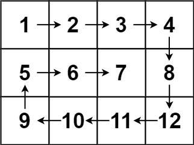

# [力扣 Top 20] LC 54 螺旋矩阵 中等

<p class="daily-archive-kicker">2026-07-27 · 第 11/14 题 · 力扣 Top</p>

<p class="daily-archive-utility"><a href="index.md">返回 2026-07-27 题目列表</a> · <a href="../../basics/sequence-invariants.md">进入知识专题</a></p>

## 官方原始信息

- 题号：54
- 官方中文标题：螺旋矩阵
- 官方难度：中等
- 官方链接：https://leetcode.cn/problems/spiral-matrix/
- slug：`spiral-matrix`
- 函数签名：`vector<int> spiralOrder(vector<vector<int>>& matrix)`
- 官方竞赛分：未标注。官方题面与本轮核对的官方 GraphQL 元数据均未提供竞赛归属或分值，不作推断。
- ZeroTracer 社区估算竞赛分：未收录。本轮于 2026-07-27 按题号与 slug 精确检索其公开 `data.json`，无匹配记录。

### 原始题意

给定一个 $m\times n$ 矩阵，从左上角开始，沿上边向右、右边向下、下边向左、左边向上，逐层向内，按顺时针螺旋顺序返回全部元素。

### 官方示例图片




### 全部官方样例

1. 输入 `[[1,2,3],[4,5,6],[7,8,9]]`，输出 `[1,2,3,6,9,8,7,4,5]`。
2. 输入 `[[1,2,3,4],[5,6,7,8],[9,10,11,12]]`，输出 `[1,2,3,4,8,12,11,10,9,5,6,7]`。

### 全部官方约束

- `m == matrix.length`
- `n == matrix[i].length`
- $1\le m,n\le10$
- $-100\le matrix[i][j]\le100$

## 约束推导与最优结论

必须输出全部 $mn$ 个元素，所以时间下界是 $\Omega(mn)$。模拟的核心是保证每个格子恰访问一次：

- 通用做法用 `visited` 记录走过的格子，时间 $O(mn)$、额外空间 $O(mn)$；
- 更紧凑的做法维护未访问矩形的 `top,bottom,left,right` 四条边界，每完成一条边就向内收缩。输出之外只用常数变量，时间 $O(mn)$、额外空间 $O(1)$，达到下界。

矩阵元素只被读取，不做算术，`int` 足够。`answer.reserve(m*n)` 在当前约束下安全。

## 样例手推与边界

对 $3\times4$ 样例：

1. 上边：`1,2,3,4`，`top` 下移；
2. 右边：`8,12`，`right` 左移；
3. 下边反向：`11,10,9`，`bottom` 上移；
4. 左边反向：`5`，`left` 右移；
5. 剩余矩形只有一行 `6,7`，访问后结束。

最容易出错的是退化层：

- 单行矩阵只能走一次上边；
- 单列矩阵只能走一次对应边；
- 奇数行列最终可能剩一个中心格；
- $1\times1$；
- 长条矩阵；
- 元素值可以重复，不能用值判断是否访问。

## 解法一：方向数组 + 访问标记

每次尝试沿当前方向走一步；越界或下一格已访问时顺时针转向。执行恰好 `m*n` 次，就不会因四周都访问过而无限循环。

<!-- compile:leetcode -->
```cpp
#include <bits/stdc++.h>
using namespace std;
class Solution {
public:
  vector<int> spiralOrder(vector<vector<int>>& matrix) {
    int rows = matrix.size();
    int columns = matrix[0].size();
    vector<vector<char>> visited(rows, vector<char>(columns));
    int dr[4] = {0, 1, 0, -1};
    int dc[4] = {1, 0, -1, 0};
    int row = 0, column = 0, direction = 0;
    vector<int> answer;
    answer.reserve(rows * columns);
    for (int count = 0; count < rows * columns; ++count) {
      answer.push_back(matrix[row][column]);
      visited[row][column] = 1;
      int nextRow = row + dr[direction];
      int nextColumn = column + dc[direction];
      if (nextRow < 0 || nextRow >= rows || nextColumn < 0 || nextColumn >= columns || visited[nextRow][nextColumn]) {
        direction = (direction + 1) % 4;
        nextRow = row + dr[direction];
        nextColumn = column + dc[direction];
      }
      row = nextRow;
      column = nextColumn;
    }
    return answer;
  }
};
```

时间 $O(mn)$，额外空间 $O(mn)$。它容易扩展到障碍物，但对规则矩形保存了不必要的访问状态。

## 解法二：四边界逐层收缩（最佳实用解）

<!-- compile:leetcode -->
```cpp
#include <bits/stdc++.h>
using namespace std;
class Solution {
public:
  vector<int> spiralOrder(vector<vector<int>>& matrix) {
    int top = 0;
    int bottom = matrix.size() - 1;
    int left = 0;
    int right = matrix[0].size() - 1;
    vector<int> answer;
    answer.reserve(matrix.size() * matrix[0].size());
    while (top <= bottom && left <= right) {
      for (int column = left; column <= right; ++column) answer.push_back(matrix[top][column]);
      ++top;
      for (int row = top; row <= bottom; ++row) answer.push_back(matrix[row][right]);
      --right;
      if (top <= bottom) {
        for (int column = right; column >= left; --column) answer.push_back(matrix[bottom][column]);
        --bottom;
      }
      if (left <= right) {
        for (int row = bottom; row >= top; --row) answer.push_back(matrix[row][left]);
        ++left;
      }
    }
    return answer;
  }
};
```

时间 $O(mn)$，输出之外额外空间 $O(1)$。

### 正确性证明

循环不变量：每轮开始时，边界 `[top..bottom] × [left..right]` 恰好包含所有尚未输出的格子，边界外的格子已经按螺旋顺序恰好输出一次。

一轮依次输出当前矩形的上边、右边、下边和左边，并在每条边后收缩对应边界。下边只在仍有未访问行时执行，左边只在仍有未访问列时执行，因而单行、单列不会重复。四条边按顺时针顺序恰好构成当前最外层；收缩后未访问区域仍是一个矩形，不变量成立。边界交叉时没有未访问格，循环结束；因此全部 $mn$ 个格子按要求恰好输出一次。

## 解法三：递归输出每一层

递归函数负责一个未访问矩形的外圈，再递归到四边均缩进一格的内层。退化为单行或单列时单独输出并返回。

<!-- compile:leetcode -->
```cpp
#include <bits/stdc++.h>
using namespace std;
class Solution {
  void walk(const vector<vector<int>>& matrix, int top, int bottom, int left, int right, vector<int>& answer) {
    if (top > bottom || left > right) return;
    if (top == bottom) {
      for (int column = left; column <= right; ++column) answer.push_back(matrix[top][column]);
      return;
    }
    if (left == right) {
      for (int row = top; row <= bottom; ++row) answer.push_back(matrix[row][left]);
      return;
    }
    for (int column = left; column <= right; ++column) answer.push_back(matrix[top][column]);
    for (int row = top + 1; row <= bottom; ++row) answer.push_back(matrix[row][right]);
    for (int column = right - 1; column >= left; --column) answer.push_back(matrix[bottom][column]);
    for (int row = bottom - 1; row > top; --row) answer.push_back(matrix[row][left]);
    walk(matrix, top + 1, bottom - 1, left + 1, right - 1, answer);
  }
public:
  vector<int> spiralOrder(vector<vector<int>>& matrix) {
    vector<int> answer;
    answer.reserve(matrix.size() * matrix[0].size());
    walk(matrix, 0, matrix.size() - 1, 0, matrix[0].size() - 1, answer);
    return answer;
  }
};
```

时间 $O(mn)$，递归栈 $O(\min(m,n))$。它与边界迭代同阶，但额外栈和退化分支更多，实战优先迭代版。

## 方案比较与推荐

- 访问标记模拟：状态直观，适合形状不规则或存在障碍的扩展，空间 $O(mn)$。
- 四边界迭代：常数空间、一次访问、边界语义清楚，是面试首选。
- 递归分层：能突出“外圈 + 子问题”结构，但没有复杂度优势。
- 无论使用哪种写法，都应以输出元素数恰为 `rows*columns` 作为验证不变量。

## 常见错误

- 完成上边和右边后不检查剩余行列，导致单行或单列重复。
- 下边或左边循环端点包含错误，角元素访问两次。
- 依赖矩阵值作为访问哨兵；值域允许重复，也可能包含所选哨兵。
- 行列变量混淆，尤其在非方阵上。
- `bottom`、`right` 使用无符号类型后减到负数。
- 用 `while (answer.size() <= rows*columns)` 多执行一次。

## Follow-up 1：生成顺时针螺旋矩阵

遍历顺序不变，但动作从“读取”改为“写入递增整数”。对应 [LC 59 螺旋矩阵 II](https://leetcode.cn/problems/spiral-matrix-ii/)。

<!-- compile:leetcode -->
```cpp
#include <bits/stdc++.h>
using namespace std;
class Solution {
public:
  vector<vector<int>> generateMatrix(int n) {
    vector<vector<int>> matrix(n, vector<int>(n));
    int top = 0, bottom = n - 1, left = 0, right = n - 1, value = 1;
    while (top <= bottom && left <= right) {
      for (int column = left; column <= right; ++column) matrix[top][column] = value++;
      ++top;
      for (int row = top; row <= bottom; ++row) matrix[row][right] = value++;
      --right;
      if (top <= bottom) {
        for (int column = right; column >= left; --column) matrix[bottom][column] = value++;
        --bottom;
      }
      if (left <= right) {
        for (int row = bottom; row >= top; --row) matrix[row][left] = value++;
        ++left;
      }
    }
    return matrix;
  }
};
```

时间、输出空间均为 $O(n^2)$，额外空间 $O(1)$。

## Follow-up 2：从左上角开始逆时针遍历

方向次序改为“左边向下、下边向右、右边向上、上边向左”，并保持同样的退化边界检查。

<!-- compile:leetcode -->
```cpp
#include <bits/stdc++.h>
using namespace std;
class Solution {
public:
  vector<int> counterclockwiseOrder(vector<vector<int>>& matrix) {
    int top = 0, bottom = matrix.size() - 1;
    int left = 0, right = matrix[0].size() - 1;
    vector<int> answer;
    while (top <= bottom && left <= right) {
      for (int row = top; row <= bottom; ++row) answer.push_back(matrix[row][left]);
      ++left;
      for (int column = left; column <= right; ++column) answer.push_back(matrix[bottom][column]);
      --bottom;
      if (left <= right) {
        for (int row = bottom; row >= top; --row) answer.push_back(matrix[row][right]);
        --right;
      }
      if (top <= bottom) {
        for (int column = right; column >= left; --column) answer.push_back(matrix[top][column]);
        ++top;
      }
    }
    return answer;
  }
};
```

时间 $O(mn)$，输出之外额外空间 $O(1)$。

## Follow-up 3：从任意中心向外无限螺旋，记录落在网格内的坐标

路径可暂时走出网格，但只收集合法坐标。向东、南、西、北移动，步长按 `1,1,2,2,3,3,...` 增长。对应 [LC 885 螺旋矩阵 III](https://leetcode.cn/problems/spiral-matrix-iii/)。

<!-- compile:leetcode -->
```cpp
#include <bits/stdc++.h>
using namespace std;
class Solution {
public:
  vector<vector<int>> spiralMatrixIII(int rows, int columns, int startRow, int startColumn) {
    vector<vector<int>> answer;
    int row = startRow, column = startColumn;
    answer.push_back({row, column});
    int dr[4] = {0, 1, 0, -1};
    int dc[4] = {1, 0, -1, 0};
    for (int length = 1, direction = 0; (int)answer.size() < rows * columns; ++length) {
      for (int repeat = 0; repeat < 2; ++repeat) {
        for (int step = 0; step < length; ++step) {
          row += dr[direction];
          column += dc[direction];
          if (0 <= row && row < rows && 0 <= column && column < columns) {
            answer.push_back({row, column});
          }
        }
        direction = (direction + 1) % 4;
      }
    }
    return answer;
  }
};
```

输出包含 $mn$ 个坐标；走过的总步数受起点和网格外接方形影响，常见上界为 $O((m+n)^2)$，输出空间 $O(mn)$。

## Follow-up 4：用链表按螺旋顺序填矩阵

矩阵先填 `-1`，每访问一个边界位置就消耗一个链表节点；链表提前结束时立即返回。对应 [LC 2326 螺旋矩阵 IV](https://leetcode.cn/problems/spiral-matrix-iv/)。

<!-- compile:leetcode -->
```cpp
#include <bits/stdc++.h>
using namespace std;
struct ListNode {
  int val;
  ListNode* next;
  ListNode(int value = 0, ListNode* following = nullptr) : val(value), next(following) {}
};
class Solution {
public:
  vector<vector<int>> spiralMatrix(int rows, int columns, ListNode* head) {
    vector<vector<int>> matrix(rows, vector<int>(columns, -1));
    int top = 0, bottom = rows - 1, left = 0, right = columns - 1;
    auto place = [&](int row, int column) {
      if (!head) return false;
      matrix[row][column] = head->val;
      head = head->next;
      return true;
    };
    while (top <= bottom && left <= right && head) {
      for (int column = left; column <= right; ++column) {
        if (!place(top, column)) return matrix;
      }
      ++top;
      for (int row = top; row <= bottom; ++row) {
        if (!place(row, right)) return matrix;
      }
      --right;
      if (top <= bottom) {
        for (int column = right; column >= left; --column) {
          if (!place(bottom, column)) return matrix;
        }
        --bottom;
      }
      if (left <= right) {
        for (int row = bottom; row >= top; --row) {
          if (!place(row, left)) return matrix;
        }
        ++left;
      }
    }
    return matrix;
  }
};
```

时间 $O(mn)$，返回矩阵空间 $O(mn)$，额外空间 $O(1)$。

## Follow-up 5：只查询螺旋序列第 `k` 个元素

不生成整个序列。逐层计算外圈长度并跳过完整层；目标落在当前层时，根据它位于上、右、下、左哪条边直接换算坐标。`k` 使用从 0 开始的下标。

<!-- compile:leetcode -->
```cpp
#include <bits/stdc++.h>
using namespace std;
class Solution {
public:
  int spiralKth(const vector<vector<int>>& matrix, int k) {
    int top = 0, left = 0;
    int height = matrix.size();
    int width = matrix[0].size();
    if (k < 0 || k >= height * width) throw out_of_range("invalid spiral index");
    while (true) {
      int perimeter;
      if (height == 1) perimeter = width;
      else if (width == 1) perimeter = height;
      else perimeter = 2 * height + 2 * width - 4;
      if (k >= perimeter) {
        k -= perimeter;
        ++top;
        ++left;
        height -= 2;
        width -= 2;
        continue;
      }
      if (height == 1) return matrix[top][left + k];
      if (width == 1) return matrix[top + k][left];
      if (k < width) return matrix[top][left + k];
      k -= width;
      if (k < height - 1) return matrix[top + 1 + k][left + width - 1];
      k -= height - 1;
      if (k < width - 1) return matrix[top + height - 1][left + width - 2 - k];
      k -= width - 1;
      return matrix[top + height - 2 - k][left];
    }
  }
};
```

最多跳过 $O(\min(m,n))$ 层，空间 $O(1)$。若有大量 `k` 查询，可预处理每层前缀长度后二分所在层。

## Follow-up 6：原地顺时针旋转方阵 90°

螺旋遍历只改变访问顺序；旋转会改变位置。先沿主对角线转置，再反转每一行，即可把 `(row,column)` 映射到 `(column,n-1-row)`。对应 [LC 48 旋转图像](https://leetcode.cn/problems/rotate-image/)。

<!-- compile:leetcode -->
```cpp
#include <bits/stdc++.h>
using namespace std;
class Solution {
public:
  void rotate(vector<vector<int>>& matrix) {
    int n = matrix.size();
    for (int row = 0; row < n; ++row) {
      for (int column = row + 1; column < n; ++column) {
        swap(matrix[row][column], matrix[column][row]);
      }
    }
    for (auto& row : matrix) reverse(row.begin(), row.end());
  }
};
```

时间 $O(n^2)$，额外空间 $O(1)$。

## 验证说明

- 对随机小矩阵，用访问标记模拟作 oracle，比较四边界迭代与递归分层。
- `spiralKth` 对每个合法 `k` 与完整螺旋序列逐项比较。
- 固定覆盖两个官方样例、`1×1`、单行、单列、奇偶尺寸和非方阵。
- 本文每个 C++ 代码块均按 C++23 单独做语法编译；随机种子、用例规模与真实结果记录在同目录机器报告中。

## Reference

- [官方题目](https://leetcode.cn/problems/spiral-matrix/)
- [对应知识专题](../../basics/sequence-invariants.md)

<nav class="daily-archive-pager" aria-label="当日题目导航">
<a class="daily-archive-pager__previous" href="leetcode-top-19-lc72.md">← [力扣 Top 19] LC 72 编辑距离 中等</a>
<a class="daily-archive-pager__next" href="leetcode-weekly-511-q2-lc3997.md">[力扣竞赛] 第 511 场周赛 Q2 LC 3997 统计二叉树中支配节点的数量 中等 →</a>
</nav>
