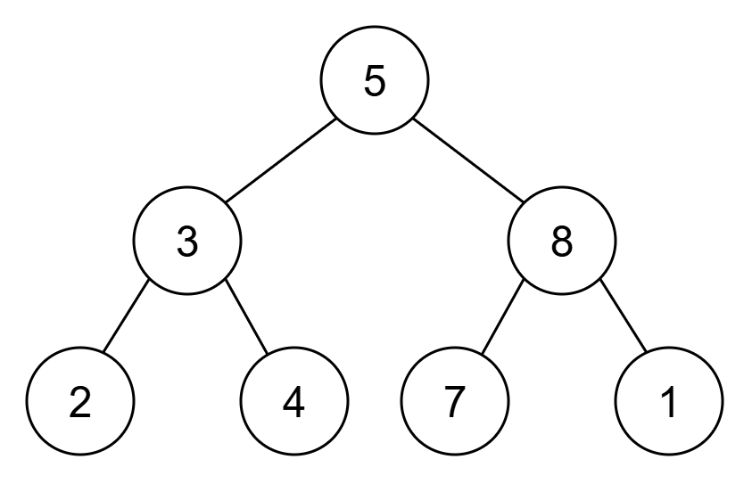
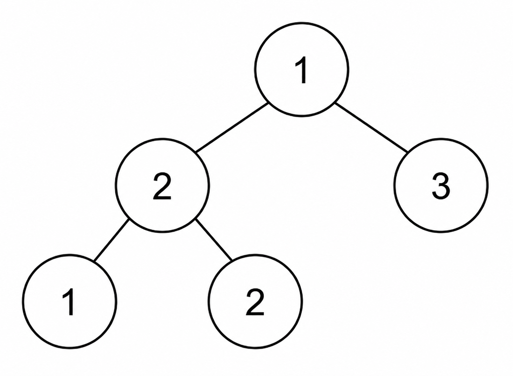

# [力扣竞赛] 第 511 场周赛 Q2 LC 3997 统计二叉树中支配节点的数量 中等

<p class="daily-archive-kicker">2026-07-27 · 第 12/14 题 · 力扣竞赛</p>

<p class="daily-archive-utility"><a href="../">返回 2026-07-27 题目列表</a> · <a href="../../../graph/tree-aggregation/">进入知识专题</a></p>

官方题目：[打开官方题目](https://leetcode.cn/problems/count-dominant-nodes-in-a-binary-tree/)

## 官方原始信息

- 平台与比赛：力扣中国，第 511 场周赛。
- 官方题目标识：LC 3997，slug 为 `count-dominant-nodes-in-a-binary-tree`。
- 官方中文标题：统计二叉树中支配节点的数量。
- 官方英文标题：Count Dominant Nodes in a Binary Tree。
- 官方难度：中等。
- 官方比赛位置与分值：Q2，4 分。
- ZeroTracer 社区估算竞赛分：`1426.5661260433`，获取于 2026-07-27；这不是力扣官方难度。
- 当前题目接口返回的官方标签：无。
- 程序接口：力扣 C++ 函数签名。

## 完整题意

给定一棵<strong>完全二叉树</strong>的根节点。若节点 $x$ 的值等于以 $x$ 为根的子树中所有节点值的最大值，则称 $x$ 为<strong>支配节点</strong>。返回支配节点总数。

完全二叉树除最后一层外均被填满，最后一层从左到右连续填充。以 $x$ 为根的子树包含 $x$ 自身及其全部后代。

### 官方函数签名

```text
int countDominantNodes(TreeNode* root)
```

### 全部官方约束

- 节点数位于 $[1,10^5]$。
- $1\le\texttt{Node.val}\le10^9$。
- 输入保证为完全二叉树。

### 全部官方样例与图片

样例 1 官方图片：



- 官方图片尺寸：300 × 193 像素。
- 输入：`root = [5,3,8,2,4,7,1]`
- 输出：`5`
- 解释：叶子 2、4、7、1 都是支配节点；节点 8 也是支配节点，因为 8 是子树 `[8,7,1]` 的最大值。

样例 2 官方图片：



- 官方图片尺寸：250 × 183 像素。
- 输入：`root = [1,2,3,1,2]`
- 输出：`4`
- 解释：三个叶子都是支配节点；子树 `[2,1,2]` 的根节点 2 也是支配节点。

## 中文题意与样例说明

给定一棵完整二叉树。若节点值等于以该节点为根的整棵子树中的最大值，则称它为支配节点；子树包含节点自身与全部后代。返回整棵树中支配节点的数量。

样例 1 的四个叶子天然满足条件，值为 8 的内部节点也是其子树最大值，所以答案为 5。样例 2 的三个叶子和左侧值为 2 的内部节点满足条件，答案为 4。完整二叉树的最后一层从左到右填充；函数签名、全部约束、示例图片和数据以上方官方信息为准。

## 从约束推导

定义中的信息从后代流向祖先，因此后序遍历最自然：只有先得到左右子树最大值，才能判断父节点。这里必须注意“等于”：若子树最大值出现多次，只要子树根节点也取到该最大值，它仍是支配节点。

完全二叉树的高度为 $O(\log n)$。在 $n\le10^5$ 下，递归后序遍历只占用 $O(\log n)$ 层调用栈，足够安全。节点值和答案均可放入 `int`，算法也不涉及求和，不存在整数溢出风险。

关键边界：

- 叶子节点总是支配节点。
- 单节点树的答案为 1。
- 若所有节点值相等，则每个节点都是支配节点。
- 根节点恰在其值等于全树最大值时成为支配节点。
- 一个较大的后代会使祖先链上所有较小节点失效，但不会影响无关子树。

## 样例 1 的后序状态演化

四个叶子分别返回最大值 2、4、7、1，并各贡献 1。节点 3 收到子树最大值 2 和 4，因此自身子树最大值为 4，不贡献答案。节点 8 收到 7 和 1，自身仍为最大值，贡献 1。根节点 5 收到左右子树最大值 4 和 8，因此全树最大值为 8，根节点不贡献答案。总计 $4+1=5$。

## 解法一：为每个节点重新扫描子树

对每个节点独立遍历其整棵子树求最大值，再递归统计左右孩子。

该暴力解直接逐节点检验定义，因此正确。完全二叉树第 $d$ 层有 $2^d$ 个节点，每棵对应子树包含 $O(n/2^d)$ 个节点，所以每一层总工作量为 $O(n)$，合计 $O(n\log n)$。若没有完全性保证，链状树会退化到 $O(n^2)$。

<!-- compile:leetcode-tree -->
```cpp
// LEETCODE_SNIPPET
class Solution {
  int subtreeMax(TreeNode* node) {
    if (!node) return INT_MIN;
    return max({node->val, subtreeMax(node->left), subtreeMax(node->right)});
  }
  int count(TreeNode* node) {
    if (!node) return 0;
    return (node->val == subtreeMax(node)) + count(node->left) + count(node->right);
  }
public:
  int countDominantNodes(TreeNode* root) {
    return count(root);
  }
};
```

- 时间复杂度：在完全二叉树保证下为 $O(n\log n)$。
- 额外空间：$O(\log n)$。
- 瓶颈：每个后代的值会为其每一层祖先重复参与最大值计算。

## 解法二：一次后序聚合（推荐）

每棵子树同时向父节点返回两个信息：子树最大值与支配节点数量。每个节点只处理一次。

### 正确性证明

对子树规模做归纳。空树返回最大值 $-\infty$ 和计数 0，显然正确。假设左右子树返回结果均正确，则当前子树最大值就是当前节点值与两个子树最大值的最大者；当前节点恰在自身值等于该最大值时为支配节点。当前子树中的支配节点恰由左子树、右子树以及可能的当前节点组成，三者互不重叠。因此返回的最大值和计数都正确，归纳可得根节点结果正确。

<!-- compile:leetcode-tree -->
```cpp
// LEETCODE_SNIPPET
class Solution {
  pair<int, int> dfs(TreeNode* node) {
    if (!node) return {INT_MIN, 0};
    auto [leftMax, leftCount] = dfs(node->left);
    auto [rightMax, rightCount] = dfs(node->right);
    int subtreeMax = max({node->val, leftMax, rightMax});
    int count = leftCount + rightCount + (node->val == subtreeMax);
    return {subtreeMax, count};
  }
public:
  int countDominantNodes(TreeNode* root) {
    return dfs(root).second;
  }
};
```

- 时间复杂度：$O(n)$。
- 额外空间：由完全二叉树高度决定，为 $O(\log n)$。
- 记忆建议：优先掌握“后序遍历并返回父节点所需聚合量”的模式。它实现简洁、渐近最优，也容易迁移到其他子树统计问题。

## 同阶替代方案：逆序处理隐式堆

完全二叉树的层序恰好对应隐式堆：下标 $i$ 的两个孩子为 $2i+1$ 与 $2i+2$。将层序节点数组从后向前处理即可。

该方案避免递归，但需要 $O(n)$ 额外内存；当输入本身就是层序数组或环境禁止递归时很实用。

<!-- compile:leetcode-tree -->
```cpp
// LEETCODE_SNIPPET
class Solution {
public:
  int countDominantNodes(TreeNode* root) {
    vector<TreeNode*> nodes;
    queue<TreeNode*> que;
    que.push(root);
    while (!que.empty()) {
      TreeNode* node = que.front();
      que.pop();
      nodes.push_back(node);
      if (node->left) que.push(node->left);
      if (node->right) que.push(node->right);
    }
    int n = nodes.size();
    vector<int> subtreeMax(n);
    int ans = 0;
    for (int i = n - 1; i >= 0; --i) {
      int value = nodes[i]->val;
      int left = 2 * i + 1;
      int right = 2 * i + 2;
      if (left < n) value = max(value, subtreeMax[left]);
      if (right < n) value = max(value, subtreeMax[right]);
      subtreeMax[i] = value;
      ans += nodes[i]->val == value;
    }
    return ans;
  }
};
```

- 时间复杂度：$O(n)$。
- 额外空间：$O(n)$。
- 权衡：比递归后序占用更多内存，但没有调用栈；若输入本身是数组，缓存局部性也更好。

## 常见错误

- 使用前序遍历：后代最大值未知时无法判断父节点。
- 用 `>` 而非与子树最大值比较相等；最大值并列仍然合法。
- 只与直接孩子比较，而忽略更深后代。
- 把本题与根到节点路径上的“好节点”概念混淆。
- 向父节点返回当前节点值，而不是完整子树最大值。
- 在允许负数的变种中把空树最大值设为 0；使用 `INT_MIN` 更稳健。

## 追问一：严格大于所有真后代

<strong>新定义。</strong>若节点值严格大于其所有真后代，则称它严格支配。叶子节点没有真后代，因此自然满足条件。

此时并列最大会使内部节点失效，因此要先比较当前值与左右子树最大值，再把当前值纳入返回的子树最大值。

<!-- compile:leetcode-tree -->
```cpp
// LEETCODE_SNIPPET
class Solution {
  pair<int, int> dfs(TreeNode* node) {
    if (!node) return {INT_MIN, 0};
    auto [leftMax, leftCount] = dfs(node->left);
    auto [rightMax, rightCount] = dfs(node->right);
    int descendantMax = max(leftMax, rightMax);
    int count = leftCount + rightCount + (node->val > descendantMax);
    return {max(node->val, descendantMax), count};
  }
public:
  int countStrictDominantNodes(TreeNode* root) {
    return dfs(root).second;
  }
};
```

- 时间复杂度：$O(n)$。
- 额外空间：$O(h)$，其中 $h$ 为树高。

## 追问二：根到节点路径上的“好节点”

<strong>新定义。</strong>统计节点值不小于根到该节点路径上所有值的节点数量。

依赖方向已由“后代到祖先”变成“祖先到后代”，原来的自底向上聚合不再适用，应改为自顶向下传递路径前缀最大值。

<!-- compile:leetcode-tree -->
```cpp
// LEETCODE_SNIPPET
class Solution {
  int dfs(TreeNode* node, int prefixMax) {
    if (!node) return 0;
    int good = node->val >= prefixMax;
    int nextMax = max(prefixMax, node->val);
    return good + dfs(node->left, nextMax) + dfs(node->right, nextMax);
  }
public:
  int countPathDominantNodes(TreeNode* root) {
    return dfs(root, INT_MIN);
  }
};
```

- 时间复杂度：$O(n)$。
- 额外空间：$O(h)$。
- 模型变化：子树性质通常向上聚合，路径前缀性质通常向下传递。

## 追问三：恢复全部支配节点的堆下标

<strong>新定义。</strong>按升序返回所有支配节点从 1 开始的层序下标。

逆序堆方案已经算出每棵子树的最大值，只需记录节点值与对应子树最大值相等的下标。

<!-- compile:leetcode-tree -->
```cpp
// LEETCODE_SNIPPET
class Solution {
public:
  vector<int> dominantIndices(TreeNode* root) {
    vector<TreeNode*> nodes;
    queue<TreeNode*> que;
    que.push(root);
    while (!que.empty()) {
      TreeNode* node = que.front();
      que.pop();
      nodes.push_back(node);
      if (node->left) que.push(node->left);
      if (node->right) que.push(node->right);
    }
    int n = nodes.size();
    vector<int> subtreeMax(n);
    vector<int> answer;
    for (int i = n - 1; i >= 0; --i) {
      int value = nodes[i]->val;
      if (2 * i + 1 < n) value = max(value, subtreeMax[2 * i + 1]);
      if (2 * i + 2 < n) value = max(value, subtreeMax[2 * i + 2]);
      subtreeMax[i] = value;
      if (nodes[i]->val == value) answer.push_back(i + 1);
    }
    reverse(answer.begin(), answer.end());
    return answer;
  }
};
```

- 时间复杂度：$O(n)$。
- 额外空间：$O(n)$，包含输出。

## 追问四：完全二叉树上的在线点修改

<strong>新定义。</strong>树形固定，并按从 1 开始的堆下标存储。`U i x` 把节点 $i$ 的值改为 $x$；`Q` 查询当前支配节点总数。

一次修改只会影响该节点及其祖先的子树最大值和支配状态，因此沿长度为 $O(\log n)$ 的祖先链重新计算即可。

<!-- compile:leetcode -->
```cpp
// STANDALONE
#include <bits/stdc++.h>
using namespace std;
class DominantTracker {
  int n;
  int total = 0;
  vector<long long> value, subtreeMax;
  vector<char> dominant;
  void recalc(int i) {
    long long nextMax = value[i];
    if (2 * i <= n) nextMax = max(nextMax, subtreeMax[2 * i]);
    if (2 * i + 1 <= n) nextMax = max(nextMax, subtreeMax[2 * i + 1]);
    bool nextDominant = value[i] == nextMax;
    total += nextDominant - dominant[i];
    dominant[i] = nextDominant;
    subtreeMax[i] = nextMax;
  }
public:
  explicit DominantTracker(vector<long long> initial) {
    n = (int)initial.size() - 1;
    value = std::move(initial);
    subtreeMax.resize(n + 1);
    dominant.assign(n + 1, false);
    for (int i = n; i >= 1; --i) recalc(i);
  }
  void update(int i, long long x) {
    value[i] = x;
    while (i >= 1) {
      recalc(i);
      i /= 2;
    }
  }
  int count() const {
    return total;
  }
};
int main() {
  ios::sync_with_stdio(false);
  cin.tie(nullptr);
  int n, q;
  cin >> n >> q;
  vector<long long> value(n + 1);
  for (int i = 1; i <= n; ++i) cin >> value[i];
  DominantTracker tracker(std::move(value));
  while (q--) {
    char type;
    cin >> type;
    if (type == 'Q') {
      cout << tracker.count() << '\n';
    } else {
      int i;
      long long x;
      cin >> i >> x;
      tracker.update(i, x);
    }
  }
}
```

- 构建：$O(n)$。
- 单次修改：$O(\log n)$。
- 单次查询：$O(1)$。
- 空间复杂度：$O(n)$。

## 追问五：节点值位于子树前 $k$ 大

<strong>新定义。</strong>若子树中严格大于当前节点值的节点不足 $k$ 个，则当前节点合格；相同值共享名次。

每棵子树只保留最大的 $k$ 个值。若至少有 $k$ 个后代值更大，这 $k$ 个见证值截断后仍会保留；否则所有更大值都会保留。因此截断不会影响判断的准确性。

<!-- compile:leetcode-tree -->
```cpp
// LEETCODE_SNIPPET
class Solution {
  struct State {
    vector<int> top;
    int count;
  };
  State dfs(TreeNode* node, int k) {
    if (!node) return {{}, 0};
    State left = dfs(node->left, k);
    State right = dfs(node->right, k);
    vector<int> top = std::move(left.top);
    top.insert(top.end(), right.top.begin(), right.top.end());
    int greaterCount = 0;
    for (int value : top) greaterCount += value > node->val;
    int count = left.count + right.count + (greaterCount < k);
    top.push_back(node->val);
    sort(top.begin(), top.end(), std::greater<int>());
    if ((int)top.size() > k) top.resize(k);
    return {std::move(top), count};
  }
public:
  int countTopKSubtreeNodes(TreeNode* root, int k) {
    return dfs(root, k).count;
  }
};
```

- 时间复杂度：$O(nk\log k)$。
- 额外空间：$O(kh)$，另加合并时的临时空间。
- 当 $k=1$ 时，退化为原题的非严格支配定义。

## 追问六：任意深二叉树的非递归解法

<strong>新定义。</strong>去掉完全二叉树保证，允许树高达到 $n$。

递归算法可能栈溢出。可以显式构造一次遍历顺序，再逆序处理以模拟后序遍历。它不同于完全二叉树的隐式堆方案，能够处理任意缺失孩子的树形。

<!-- compile:leetcode-tree -->
```cpp
// LEETCODE_SNIPPET
class Solution {
public:
  int countDominantNodesIterative(TreeNode* root) {
    vector<TreeNode*> order;
    vector<TreeNode*> stack = {root};
    while (!stack.empty()) {
      TreeNode* node = stack.back();
      stack.pop_back();
      order.push_back(node);
      if (node->left) stack.push_back(node->left);
      if (node->right) stack.push_back(node->right);
    }
    unordered_map<TreeNode*, int> subtreeMax;
    int ans = 0;
    for (auto it = order.rbegin(); it != order.rend(); ++it) {
      TreeNode* node = *it;
      int value = node->val;
      if (node->left) value = max(value, subtreeMax[node->left]);
      if (node->right) value = max(value, subtreeMax[node->right]);
      subtreeMax[node] = value;
      ans += node->val == value;
    }
    return ans;
  }
};
```

- 期望时间复杂度：$O(n)$。
- 额外空间：$O(n)$。

## 可复现验证

- 使用测试框架补齐官方 `TreeNode` 定义，以 C++23 模式编译每个代码片段。
- 随机生成完全二叉树，将 $O(n\log n)$ 的子树重扫基准、递归后序与逆序堆三种实现互相对拍。
- 覆盖大量重复值、堆序严格递增、堆序严格递减、全相等与单节点树。
- 对在线修改结构随机更新堆下标，并将每次查询与完整自底向上重算比较。

## 来源

- 官方题目与 GraphQL 元数据：[打开官方题目](https://leetcode.cn/problems/count-dominant-nodes-in-a-binary-tree/)
- 官方比赛讨论与 4 分分值：[打开官方比赛讨论](https://leetcode.cn/discuss/post/3998508/di-511-chang-li-kou-zhou-sai-by-leetcode-4cwf/)
- 官方比赛页：[打开官方比赛](https://leetcode.cn/contest/weekly-contest-511/)
- ZeroTracer 数据集：[打开来源页面](https://github.com/zerotrac/leetcode_problem_rating/blob/main/ratings.txt)

## 参考资料

- [官方题目](https://leetcode.cn/problems/count-dominant-nodes-in-a-binary-tree/)
- [对应知识专题](../../graph/tree-aggregation.md)

<nav class="daily-archive-pager" aria-label="当日题目导航">
<a class="daily-archive-pager__previous" href="../leetcode-top-20-lc54/">← [力扣 Top 20] LC 54 螺旋矩阵 中等</a>
<a class="daily-archive-pager__next" href="../codeforces-2247-b/">[codeforces] CF Round 1111 Div.2 B Yet Another Constructive →</a>
</nav>
