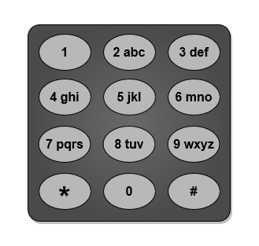

# [力扣每日一题] 2026-07-30｜LC 3014 输入单词需要的最少按键次数 I

<p class="daily-archive-kicker">2026-07-30 · 第 14/14 题 · 力扣每日一题</p>

<p class="daily-archive-utility"><a href="../">返回 2026-07-30 题目列表</a> · <a href="../../../basics/greedy-exchange/">进入知识专题</a></p>

<!-- DAILY_CANONICAL_BODY_START sha256=2252dcae4dc53bce7795192596334937170bcf6a805b599062c22df8ff595061 -->
## 官方原始信息

- 日期：2026-07-30（Asia/Shanghai）
- 题号：LC 3014
- 官方中文标题：输入单词需要的最少按键次数 I
- 官方难度：简单
- 官方链接：[输入单词需要的最少按键次数 I](https://leetcode.cn/problems/minimum-number-of-pushes-to-type-word-i/?envType=daily-question&envId=2026-07-30)

### 原始题意

字符串 `word` 由互不相同的小写英文字母组成。可以把 26 个字母重新映射到数字键 2 至 9；每个字母恰好属于一个按键，每个按键可容纳任意多个字母。同一按键中的第一个字母按一次、第二个按两次，以此类推。求输入 `word` 所需的最少总按键次数。

官方给出的普通电话键盘示意：



### 函数签名

<!-- compile:leetcode -->
```cpp
class Solution {
public:
  int minimumPushes(string word);
};
```

### 全部官方样例

```text
输入：word = "abcde"
输出：5
解释：五个字母分别放到五个按键的第一层，每个只按一次。
```

对应的官方最优映射示意：


```text
输入：word = "xycdefghij"
输出：12
解释：八个字母放在第一层，另外两个字母放在第二层，总成本为 8+2+2。
```

对应的官方最优映射示意：


### 全部约束

- $1\le |word|\le26$。
- `word` 只含小写英文字母。
- `word` 中所有字母互不相同。
- 可用按键恰有 8 个，即编号 2 至 9。

## 约束推导与最优结构

每个字母只出现一次，因此具体字母身份不影响成本，只剩“把 $n$ 个任务放入 8 个队列位置”。八个按键各有一个成本为 1 的首位置、一个成本为 2 的次位置，依此类推。为了最小化总和，必然先使用所有低成本位置：

- 第 1 至 8 个字母成本为 1；
- 第 9 至 16 个字母成本为 2；
- 第 17 至 24 个字母成本为 3；
- 第 25 至 26 个字母成本为 4。

## 解法递进

### 解法一：回溯枚举每个字母放在哪个按键

维护八个按键当前已有字母数；把新字母放入按键 `k` 的增量成本为 `count[k]+1`。对相同负载的按键做对称剪枝，但最坏仍为指数时间。

<!-- compile:leetcode -->
```cpp
#include <bits/stdc++.h>
using namespace std;
class Solution {
  int best;
  void search(int index, int length, array<int, 8>& load, int cost) {
    if (cost >= best) {
      return;
    }
    if (index == length) {
      best = cost;
      return;
    }
    unordered_set<int> used_load;
    for (int key = 0; key < 8; ++key) {
      if (!used_load.insert(load[key]).second) {
        continue;
      }
      int extra = ++load[key];
      search(index + 1, length, load, cost + extra);
      --load[key];
    }
  }
public:
  int minimumPushes(string word) {
    best = numeric_limits<int>::max();
    array<int, 8> load{};
    search(0, word.size(), load, 0);
    return best;
  }
};
```

最坏时间 $O(8^n)$，空间 $O(n)$，只适合小规模验证。

### 最佳实用解：按成本层直接计数

第 `i` 个被安排的字母使用第 $\lfloor i/8\rfloor+1$ 层。

<!-- compile:leetcode -->
```cpp
#include <bits/stdc++.h>
using namespace std;
class Solution {
public:
  int minimumPushes(string word) {
    int answer = 0;
    for (int i = 0; i < static_cast<int>(word.size()); ++i) {
      answer += i / 8 + 1;
    }
    return answer;
  }
};
```

时间复杂度 $O(n)$，额外空间 $O(1)$。实际上只用到长度，也可用分段公式在 $O(1)$ 时间计算。

## 正确性证明

把每个按键第 $d$ 个位置看作成本为 $d$ 的槽位。任意合法映射就是为每个字母选择一个互不重复槽位。

若某方案使用了成本较高的槽位，却还存在未使用的较低成本槽位，把该字母移到低成本槽位会严格降低总成本。因此最优方案必须选择全体槽位中成本最小的前 $n$ 个。成本 1、2、3、4 的槽位分别各有 8 个，所以第 `i` 个槽位成本恰为 $\lfloor i/8\rfloor+1$。算法累加的正是这些槽位成本，故全局最优。

## 样例手推

`"xycdefghij"` 长度为 10。前 8 个字母分别占据 8 个按键的第一层，贡献 8；余下 2 个字母占据任意两个按键的第二层，贡献 4，总成本为 12。

## 易错点与方案比较

- 可用键是 2 至 9，共 8 个，不是 9 个。
- 本题字母互不相同，所以无需统计频率；这正是与更一般版本 LC 3016 的差异。
- 每个按键允许映射任意数量字母，不受传统电话键盘每键三四个字母的布局限制。
- 字母具体放到哪个同层槽位不影响成本。
- 回溯解展示原始分配模型；槽位贪心是最简且最稳的推荐方案。

## 变种一：字母可以重复

新定义：`word` 中字母可重复。出现频率高的字母应占更低成本槽位。统计 26 个频率，降序排序后仍按每 8 个一层计费。

<!-- compile:standalone -->
```cpp
#include <bits/stdc++.h>
using namespace std;
int main() {
  ios::sync_with_stdio(false);
  cin.tie(nullptr);
  string word;
  cin >> word;
  array<int, 26> frequency{};
  for (char ch : word) {
    ++frequency[ch - 'a'];
  }
  sort(frequency.rbegin(), frequency.rend());
  long long answer = 0;
  for (int i = 0; i < 26; ++i) {
    answer += 1LL * frequency[i] * (i / 8 + 1);
  }
  cout << answer << '\n';
}
```

时间 $O(|word|+26\log26)$，空间 $O(26)$。交换论证：若高频字母占高成本槽、低频字母占低成本槽，交换二者不会增大且通常会减小总成本。

## 变种二：按键数量改为 $k$

新定义：有 `k` 个可重映射按键，字母仍互不相同。第 `i` 个字母的最小层数改为 $\lfloor i/k\rfloor+1$。

<!-- compile:standalone -->
```cpp
#include <bits/stdc++.h>
using namespace std;
int main() {
  ios::sync_with_stdio(false);
  cin.tie(nullptr);
  int keys;
  string word;
  cin >> keys >> word;
  if (keys <= 0) {
    cout << -1 << '\n';
    return 0;
  }
  long long answer = 0;
  for (int i = 0; i < static_cast<int>(word.size()); ++i) {
    answer += i / keys + 1;
  }
  cout << answer << '\n';
}
```

时间 $O(n)$，空间 $O(1)$。

## 变种三：每个按键最多容纳 $c$ 个字母

新定义：每个按键容量有限。若字母种类数超过 $kc$ 则无解；否则仍选择所有可用槽位中成本最低的前若干个。

<!-- compile:standalone -->
```cpp
#include <bits/stdc++.h>
using namespace std;
int main() {
  ios::sync_with_stdio(false);
  cin.tie(nullptr);
  int letters, keys, capacity;
  cin >> letters >> keys >> capacity;
  if (letters > keys * capacity) {
    cout << -1 << '\n';
    return 0;
  }
  long long answer = 0;
  for (int i = 0; i < letters; ++i) {
    answer += i / keys + 1;
  }
  cout << answer << '\n';
}
```

时间 $O(letters)$，空间 $O(1)$。容量只截断可用层数，不改变低成本槽位优先的证明。

## 变种四：输出一个具体最优映射

新定义：输出每个字母对应的按键和按压次数。按输入顺序把第 `i` 个不同字母分配到按键 `2+i%8` 的第 `i/8+1` 层即可。

<!-- compile:standalone -->
```cpp
#include <bits/stdc++.h>
using namespace std;
int main() {
  ios::sync_with_stdio(false);
  cin.tie(nullptr);
  string word;
  cin >> word;
  long long cost = 0;
  for (int i = 0; i < static_cast<int>(word.size()); ++i) {
    int key = 2 + i % 8;
    int pushes = i / 8 + 1;
    cost += pushes;
    cout << word[i] << ' ' << key << ' ' << pushes << '\n';
  }
  cout << "cost " << cost << '\n';
}
```

时间 $O(n)$，输出空间 $O(n)$。若字母有频率，应先按频率降序决定分配顺序，再输出映射。

## 可复现验证

- 两个官方样例以及长度 1、8、9、16、17、24、25、26 的层边界均应覆盖。
- 对短字符串可用回溯枚举作为 oracle，与槽位公式逐长度对拍。
- 所有完整代码按 C++23 编译；官方三张 PNG 已核对来源、类型与原始比例。

## Reference

- [力扣中国 2026-07-30 每日一题](https://leetcode.cn/problems/minimum-number-of-pushes-to-type-word-i/?envType=daily-question&envId=2026-07-30)
- [力扣中国官方题面](https://leetcode.cn/problems/minimum-number-of-pushes-to-type-word-i/)
<!-- DAILY_CANONICAL_BODY_END -->

### 延伸阅读

- [官方题目](https://leetcode.cn/problems/minimum-number-of-pushes-to-type-word-i/?envType=daily-question&envId=2026-07-30)
- [对应知识专题](../../basics/greedy-exchange.md)

<nav class="daily-archive-pager" aria-label="当日题目导航">
<a class="daily-archive-pager__previous" href="../codeforces-2247-d2/">← [codeforces] CF Round 1111 Div.2 D2 XOR Sorting (Hard Version)</a>
<span class="daily-archive-pager__empty"></span>
</nav>
