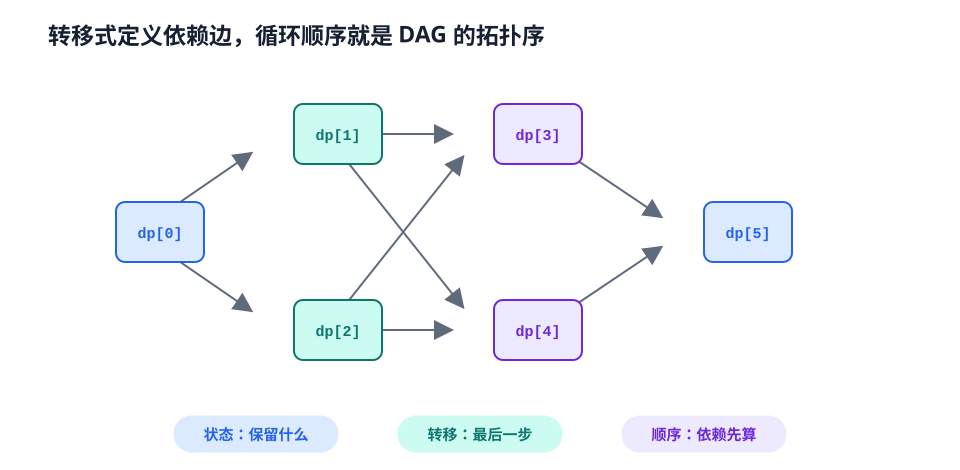

# 动态规划知识地图

动态规划（Dynamic Programming, DP）把问题拆成有重叠的子问题，并保存子问题答案。真正困难的通常不是写循环，而是设计一组“足以决定未来、又尽可能小”的状态。

<figure class="knowledge-figure" id="figure-dp-state-dag">
  <a class="knowledge-figure__image-link" href="../assets/figures/dp-state-dag.svg" aria-label="打开动态规划状态依赖图原图">
    
  </a>
  <figcaption>状态定义确定节点，最后一步确定依赖边，递推循环则必须遵守这张依赖图的拓扑顺序。</figcaption>
</figure>

## 四步推导法

### 1. 定义状态

用完整句子定义 `dp[...]`，必须包含：

- 下标分别代表什么；
- 是“恰好”还是“至多”；
- 保存可行性、方案数、最值还是概率；
- 当前状态已经处理到哪里。

例如 `dp[i]` 可以是“考虑前 $i$ 个元素的最大答案”，也可以是“以第 $i$ 个元素结尾的最大答案”，两者转移完全不同。

### 2. 枚举最后一个决策

从最优方案的最后一步反推：

- 最后选了哪个物品；
- 最后一段从哪里开始；
- 最后一次匹配了哪两个字符；
- 当前节点的子树选择了哪些状态。

把所有互斥且完备的最后决策取最优或求和，就得到转移。

### 3. 确定依赖顺序

状态之间的依赖应构成 DAG。递推顺序必须保证使用一个状态前它已经计算完成。空间压缩后，循环方向尤其重要。

### 4. 初始化与答案

- 合法起点赋真实初值；
- 不可达状态赋 `INF`、`-INF` 或 `false`；
- 计数 DP 的空方案通常是 1；
- 答案未必是最后一个状态，可能需要对所有终点取最优。

## 0/1 背包：循环方向体现语义

每件物品最多选一次。定义 `dp[j]` 为容量不超过 $j$ 时的最大价值，处理物品 $(w,v)$ 时必须倒序枚举容量，避免同一物品在本轮被重复使用。

```cpp
#include <bits/stdc++.h>
using namespace std;
int main() {
    ios::sync_with_stdio(false);
    cin.tie(nullptr);
    int n, W;
    cin >> n >> W;
    vector<int> dp(W + 1);
    for (int i = 0, w, v; i < n; ++i) {
        cin >> w >> v;
        for (int j = W; j >= w; --j) dp[j] = max(dp[j], dp[j - w] + v);
    }
    cout << dp[W] << '\n';
}
```

时间 $O(nW)$，空间 $O(W)$。若正序枚举，就变成物品可重复选择的完全背包语义。

## 常见模型

| 模型 | 典型状态 | 关键问题 |
| --- | --- | --- |
| 线性 DP | `dp[i]` | 前缀或以 $i$ 结尾 |
| 背包 | `dp[i][capacity]` | 物品选择次数与容量维度 |
| 最长子序列 | `dp[i]` 或按值维护 | “结尾”状态与顺序关系 |
| 区间 DP | `dp[l][r]` | 最后合并点或先处理哪一端 |
| 树形 DP | `dp[u][state]` | 子树合并与父子约束 |
| 状态压缩 DP | `dp[mask][state]` | 小集合的选择状态 |
| 数位 DP | `dp[pos][state][tight]` | 前缀限制与数位性质 |
| 概率/期望 DP | `dp[state]` | 条件概率和自环移项 |
| DAG DP | `dp[u]` | 按拓扑序传播 |

固定阶递推从递归、记忆化到滚动状态与快速倍增的完整推导，见[线性递推：从递归树到滚动状态](linear-recurrences.md)。

同时消耗两个序列前缀的状态设计、编辑距离与路径恢复，见[双序列动态规划](sequence-dp.md)。

## 记忆化搜索还是递推

两者描述同一张状态 DAG：

- **记忆化搜索**按需访问状态，适合转移不规则、自然递归的问题；
- **递推**顺序和内存更可控，常数更小，也更容易做滚动数组。

选择能让状态依赖最清楚的写法。若递归深度可能达到 $O(n)$，还要考虑栈限制。

## 优化从哪里来

先写出正确的朴素 DP，再观察转移：

- 只依赖前一层：滚动数组；
- 转移是区间和：前缀和；
- 转移取滑动区间最值：单调队列；
- 形如 $\min_j(dp[j]+f(i,j))$：考虑斜率优化、分治优化或四边形不等式；
- 状态中有冗余维度：重新定义状态；
- 值域较小：按值而非按位置维护。

!!! warning "优化不能改变状态语义"

    滚动数组、原地更新和循环换序都可能让当前层错误读取到当前层的新值。每次压缩都应重新检查依赖方向。

## 代表题目

### 线性与子序列

--8<-- "includes/problems/lc-70.md"

--8<-- "includes/problems/lc-198.md"

--8<-- "includes/problems/lc-300.md"

### 背包

--8<-- "includes/problems/lc-416.md"

--8<-- "includes/problems/lc-494.md"

--8<-- "includes/problems/luogu-p1048.md"

### 区间、树形与状态压缩

--8<-- "includes/problems/lc-312.md"

--8<-- "includes/problems/lc-337.md"

--8<-- "includes/problems/lc-847.md"

### 双序列

--8<-- "includes/problems/lc-72.md"

## 正确性检查

- 状态是否包含决定未来所需的全部信息；
- 最优解能否唯一归入某个最后决策；
- 转移是否漏掉或重复计算方案；
- 循环顺序是否符合依赖；
- 初值代表真实的空问题还是误设的零；
- `INF + cost` 是否可能溢出；
- 求方案数时是否需要取模，重复元素是否可区分。

## Reference

- [Bellman, Dynamic Programming — Princeton University Press](https://press.princeton.edu/books/paperback/9780691146683/dynamic-programming)
- [LeetCode 198：打家劫舍](../problems/index.md#problem-lc-198)
- [LeetCode 416：分割等和子集](../problems/index.md#problem-lc-416)
